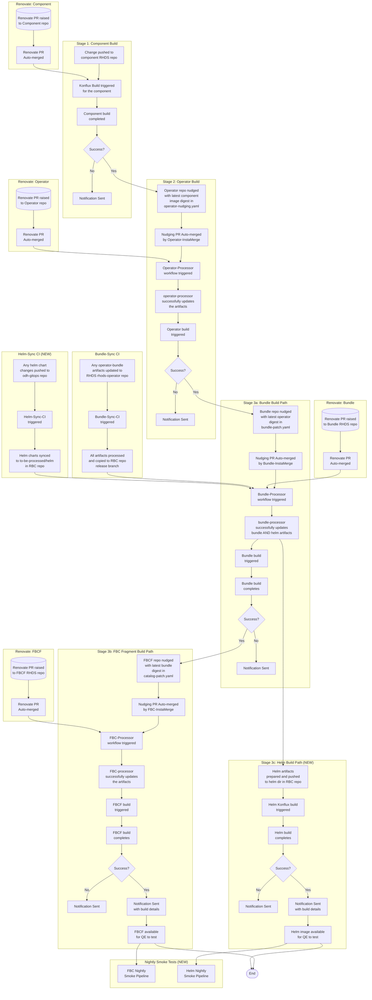

# RHOAI - Updated E2E CI Build Flow

> **Updated to include the Helm build path (parallel to Bundle/FBC)**
>
> Original Miro Board: [https://miro.com/app/board/uXjVL4SVYno=/](https://miro.com/app/board/uXjVL4SVYno=/)

---

## Table of Contents

- [Reference Docs](#reference-docs)
- [Build Types](#build-types)
- [Useful Links](#useful-links)
- [Updated Flow Diagram](#updated-flow-diagram)
- [Summary of Changes from Previous Flow](#summary-of-changes-from-previous-flow)
- [Konflux Component Builds](#konflux-component-builds)
- [Operator Build Flow](#operator-build-flow)
- [Operator-Bundle Build Flow (Existing)](#operator-bundle-build-flow)
- [FBC Fragment Build Flow (Existing)](#fbc-fragment-build-flow)
- [Helm Build Flow (NEW)](#helm-build-flow-new)
- [Helm-Sync CI (NEW)](#helm-sync-ci-new)
- [Renovate in Action](#renovate-in-action)
- [Bundle Sync CI (Existing)](#bundle-sync-ci)
- [Nightly Smoke Tests (NEW)](#nightly-smoke-tests-new)

---

## Reference Docs

- Konflux - [https://konflux.pages.redhat.com/docs/users/index.html](https://konflux.pages.redhat.com/docs/users/index.html)
- Tekton - [https://tekton.dev/docs/](https://tekton.dev/docs/)
- FBC - [https://olm.operatorframework.io/docs/reference/file-based-catalogs/](https://olm.operatorframework.io/docs/reference/file-based-catalogs/)
- Renovate - [https://docs.renovatebot.com/](https://docs.renovatebot.com/)
- Helm Charts - [https://helm.sh/docs/](https://helm.sh/docs/)

---

## Build Types

| # | Build Type | Status |
|---|-----------|--------|
| 1 | Components | Existing |
| 2 | Operator | Existing |
| 3 | Bundle | Existing |
| 4 | FBCF (FBC Fragment) | Existing |
| 5 | **Helm** | **NEW** |

---

## Useful Links

- Konflux Internal Instance - [https://konflux.apps.stone-prod-p02.hjvn.p1.openshiftapps.com/application-pipeline](https://konflux.apps.stone-prod-p02.hjvn.p1.openshiftapps.com/application-pipeline)
- Helm Charts Source Repo - [https://github.com/red-hat-data-services/odh-gitops/tree/rhai-helm-chart/charts](https://github.com/red-hat-data-services/odh-gitops/tree/rhai-helm-chart/charts)
- RBC Repo (rhoai-3.4) - [https://github.com/red-hat-data-services/RHOAI-Build-Config/tree/rhoai-3.4](https://github.com/red-hat-data-services/RHOAI-Build-Config/tree/rhoai-3.4)

---

## Updated Flow Diagram

> See the rendered Mermaid diagram in the accompanying image file: `updated-e2e-ci-build-flow.png`

---

## Summary of Changes from Previous Flow

The following table summarizes what is **new** or **modified** compared to the original E2E CI Build Flow:

| Change | Type | Description |
|--------|------|-------------|
| **Helm** added as 5th build type | NEW | Helm image build runs in parallel to the Bundle → FBC path |
| **Bundle-Processor enhanced** | MODIFIED | Now processes both bundle artifacts AND helm charts in a single run |
| **Helm-Sync CI** workflow | NEW | Syncs helm charts from `odh-gitops` repo to `to-be-processed/helm` in RBC repo (analogous to Bundle-Sync) |
| **Helm Konflux Build** | NEW | New Tekton pipeline builds the helm image and pushes to Quay |
| **Helm notifications** | NEW | Slack notifications for helm build success/failure |
| **No FBC after Helm** | DESIGN DECISION | The Helm path terminates after the helm build — there is no FBC equivalent for Helm |
| **Nightly Smoke Tests** | NEW | Both FBC nightly and Helm nightly builds trigger smoke pipelines for automated testing |

### What Stays the Same

- Component builds (Stage 1) — unchanged
- Operator build flow (Stage 2) — unchanged
- Bundle build flow (Stage 3a) — unchanged (bundle-processor is extended, not replaced)
- FBC Fragment build flow (Stage 3b) — unchanged
- Renovate automation — unchanged
- Bundle-Sync CI — unchanged
- Nudging/InstaMerge patterns — unchanged

---

## Konflux Component Builds

### General Info

- Konflux builds are Tekton pipelines which reside in the respective component repos
    - Example: [https://github.com/red-hat-data-services/odh-dashboard/tree/rhoai-2.16/.tekton](https://github.com/red-hat-data-services/odh-dashboard/tree/rhoai-2.16/.tekton)
- These pipelines are customizable up to some extent, but we cannot remove/modify the mandatory tasks
- These pipelines are automatically triggered on git push/pull-request events
- We have customized the pipelines to send Slack notifications to the `#rhoai-build-notifications` channel in case of build failures
- The DevOps team maintains the pipelines

### Docs

- [How to configure Konflux application/component build pipelines](https://konflux.pages.redhat.com/docs/users/getting-started/hands-on-learning.html)
- [Learn Tekton](https://tekton.dev/docs/)

---

## Operator Build Flow

### Nudging PR

- Each successful component build [nudges](https://konflux.pages.redhat.com/docs/users/building/component-nudges.html) the [operator-nudging.yaml](https://github.com/red-hat-data-services/rhods-operator/blob/rhoai-2.16/build/operator-nudging.yaml) in `rhods-operator` repo
- A change to any/every component results in the RHOAI operator being rebuilt. Each change will eventually trigger a bundle, FBC, **and helm** build as well (continuous integration)
- It essentially raises a PR to update the corresponding image digest in the [operator-nudging.yaml](https://github.com/red-hat-data-services/rhods-operator/blob/rhoai-2.16/build/operator-nudging.yaml)

### Operator-InstaMerge

- An InstaMerge workflow is deployed and configured on the `rhods-operator` repo with proper conditions to ensure it only merges the nudging PRs
- It only acts for nudging PRs
- It ensures that each nudging PR is merged properly along with a rebase+retry logic in case of merge failures
- InstaMerge Workflow - [operator-insta-merge.yaml](https://github.com/red-hat-data-services/rhods-operator/blob/rhoai-2.16/.github/workflows/operator-insta-merge.yaml)

### Operator-Processor

- Operator Processor Workflow - [operator-processor.yaml](https://github.com/red-hat-data-services/rhods-operator/blob/main/.github/workflows/operator-processor.yaml)
- It prepares all build-related prerequisites before triggering the odh-operator Konflux build pipeline
- It is automatically triggered as soon as a nudging PR to [operator-nudging.yaml](https://github.com/red-hat-data-services/rhods-operator/blob/rhoai-2.16/build/operator-nudging.yaml) is merged
- It completes the following tasks:
    - Picks up latest images of all components from their corresponding Quay repos (even if missed in `operator-nudging.yaml`)
    - Updates all component images and digests to [manifests-config.yaml](https://github.com/red-hat-data-services/rhods-operator/blob/rhoai-2.16/build/manifests-config.yaml) and [operands-map.yaml](https://github.com/red-hat-data-services/rhods-operator/blob/rhoai-2.16/build/operands-map.yaml)
    - Downloads corresponding version of manifests from various component repos and pushes to [prefetched-manifests](https://github.com/red-hat-data-services/rhods-operator/tree/rhoai-2.16/prefetched-manifests)
- Key artifacts:
    - [operands-map.yaml](https://github.com/red-hat-data-services/rhods-operator/blob/rhoai-2.16/build/operands-map.yaml) — exact operand images corresponding to the operator being built
    - [manifests-config.yaml](https://github.com/red-hat-data-services/rhods-operator/blob/rhoai-2.16/build/manifests-config.yaml) — details of Konflux/non-Konflux manifests to embed into the operator

### Odh-operator Konflux Build

- Automatically triggered after operator-processor successfully updates all artifacts
- Tekton pipeline - [odh-operator-v2-16-push.yaml](https://github.com/red-hat-data-services/rhods-operator/blob/rhoai-2.16/.tekton/odh-operator-v2-16-push.yaml)
- Builds the odh-operator component and pushes images to the corresponding repo
- On success: raises a nudging PR to [bundle-patch.yaml](https://github.com/red-hat-data-services/RHOAI-Build-Config/blob/rhoai-2.16/bundle/bundle-patch.yaml) in RBC repo with the newly built operator image digest
- Posts Slack notification on build failures

---

## Operator-Bundle Build Flow

### Nudging PR

- Successful completion of the odh-operator build raises a nudging PR to [bundle-patch.yaml](https://github.com/red-hat-data-services/RHOAI-Build-Config/blob/rhoai-2.16/bundle/bundle-patch.yaml) in RBC repo release branch
- Updates the corresponding operator image digest in `bundle-patch.yaml`

### Bundle-InstaMerge

- An InstaMerge workflow on the RBC repo auto-merges bundle nudging PRs
- It only acts for nudging PRs
- Includes rebase+retry logic for merge failures
- InstaMerge Workflow - [bundle-insta-merge.yaml](https://github.com/red-hat-data-services/RHOAI-Build-Config/blob/rhoai-2.16/.github/workflows/bundle-insta-merge.yaml)

### Bundle-Processor Workflow (ENHANCED — now also processes Helm)

- Bundle Processor Workflow - [process-operator-bundle.yaml](https://github.com/red-hat-data-services/RHOAI-Build-Config/blob/rhoai-2.16/.github/workflows/process-operator-bundle.yaml)
- Automatically triggered when a nudging PR to [bundle-patch.yaml](https://github.com/red-hat-data-services/RHOAI-Build-Config/blob/rhoai-2.16/bundle/bundle-patch.yaml) is merged
- **Bundle processing tasks** (existing):
    - Picks up the latest odh-operator image from its Quay repo
    - Clones the corresponding [operands-map.yaml](https://github.com/red-hat-data-services/rhods-operator/blob/rhoai-2.16/build/operands-map.yaml) based on the `git.commit` from the operator image
    - Patches up final bundle artifacts from:
        - Raw bundle content from [to-be-processed/bundle](https://github.com/red-hat-data-services/RHOAI-Build-Config/tree/rhoai-2.16/to-be-processed/bundle)
        - Configuration from [bundle-patch.yaml](https://github.com/red-hat-data-services/RHOAI-Build-Config/blob/rhoai-2.16/bundle/bundle-patch.yaml)
        - Configuration from [csv-patch.yaml](https://github.com/red-hat-data-services/RHOAI-Build-Config/blob/rhoai-2.16/bundle/csv-patch.yaml)
        - Quay images from [operands-map.yaml](https://github.com/red-hat-data-services/rhods-operator/blob/rhoai-2.16/build/operands-map.yaml)
    - Applies registry/repo replacements: `quay.io/rhoai` → `registry.redhat.io/rhoai`
    - Generates [relatedImages section](https://github.com/red-hat-data-services/RHOAI-Build-Config/blob/rhoai-2.16/bundle/manifests/rhods-operator.clusterserviceversion.yaml#L1379) from annotation images and operand images
    - Pushes [final bundle artifacts](https://github.com/red-hat-data-services/RHOAI-Build-Config/tree/rhoai-2.16/bundle) to RBC repo
    - Prepares [bundle_build_args.map](https://github.com/red-hat-data-services/RHOAI-Build-Config/blob/rhoai-2.16/bundle/bundle_build_args.map) for `git.url`/`git.commit` labels
- **Helm processing tasks** (NEW):
    - Picks up helm chart content from [to-be-processed/helm](https://github.com/red-hat-data-services/RHOAI-Build-Config/tree/rhoai-3.4) in RBC repo
    - Replaces image URIs with appropriate registry references
    - Prepares final helm chart artifacts
    - Pushes final helm charts to the `helm` directory in RBC repo
- Key artifacts:
    - [bundle-patch.yaml](https://github.com/red-hat-data-services/RHOAI-Build-Config/blob/rhoai-2.16/bundle/bundle-patch.yaml) — basic operator bundle settings (repo mappings, supported OCP versions)
    - [csv-patch.yaml](https://github.com/red-hat-data-services/RHOAI-Build-Config/blob/rhoai-2.16/bundle/csv-patch.yaml) — CSV structure with information to be modified/customized

### Odh-operator-bundle Konflux Build

- Automatically triggered after bundle-processor updates bundle artifacts
- Tekton pipeline - [odh-operator-bundle-v2-16-push.yaml](https://github.com/red-hat-data-services/RHOAI-Build-Config/blob/rhoai-2.16/.tekton/odh-operator-bundle-v2-16-push.yaml)
- Builds the odh-operator-bundle component and pushes images to the corresponding repo
- On success: raises a nudging PR to [catalog-patch.yaml](https://github.com/red-hat-data-services/RHOAI-Build-Config/blob/rhoai-2.16/catalog/catalog-patch.yaml) in RBC repo with the newly built bundle image digest
- Posts Slack notification on build failures

---

## FBC Fragment Build Flow

### Nudging PR

- Successful completion of the odh-operator-bundle build raises a nudging PR to [catalog-patch.yaml](https://github.com/red-hat-data-services/RHOAI-Build-Config/blob/rhoai-2.16/catalog/catalog-patch.yaml) in RBC repo release branch
- Updates the corresponding bundle image digest in `catalog-patch.yaml`

### FBC-InstaMerge

- An InstaMerge workflow on the RBC repo auto-merges FBC nudging PRs
- It only acts for nudging PRs
- Includes rebase+retry logic for merge failures
- InstaMerge Workflow - [fbc-insta-merge.yaml](https://github.com/red-hat-data-services/RHOAI-Build-Config/blob/rhoai-2.16/.github/workflows/fbc-insta-merge.yaml)

### FBC-Processor Workflow

- FBC Processor Workflow - [process-fbc-fragment.yaml](https://github.com/red-hat-data-services/RHOAI-Build-Config/blob/rhoai-2.16/.github/workflows/process-fbc-fragment.yaml)
- Automatically triggered when a nudging PR to [catalog-patch.yaml](https://github.com/red-hat-data-services/RHOAI-Build-Config/blob/rhoai-2.16/catalog/catalog-patch.yaml) is merged
- It completes the following tasks:
    - Picks up the latest operator-bundle image from Quay
    - Checks if [PCC cache](https://github.com/red-hat-data-services/RHOAI-Build-Config/tree/main/pcc) needs to be refreshed (in case a new RHOAI version was shipped)
    - Refreshes and validates PCC cache if needed
    - Picks up the latest production-catalog from PCC
    - Uses the latest bundle image to prepare the single bundle object using [OPM CLI](https://docs.openshift.com/container-platform/4.8/cli_reference/opm-cli.html)
    - Merges PCC data with single bundle object to produce [final catalog.yaml](https://github.com/red-hat-data-services/RHOAI-Build-Config/tree/rhoai-2.16/catalog) for all supported OCP versions
    - Validates generated catalogs against shipped RHOAI versions (prevents accidental unpublishing)
    - Pushes final catalog YAMLs to RBC repo
- Key artifact:
    - [PCC cache](https://github.com/red-hat-data-services/RHOAI-Build-Config/tree/main/pcc) — production catalog cache maintained locally; auto-refreshes when a new RHOAI version ships

### FBC-Fragment Konflux Build

- Automatically triggered after fbc-processor updates all artifacts
- Tekton pipeline - [rhoai-fbc-fragment-v2-16-push.yaml](https://github.com/red-hat-data-services/RHOAI-Build-Config/blob/rhoai-2.16/.tekton/rhoai-fbc-fragment-v2-16-push.yaml)
- CI/Nightly build is only done for OCP 4.13
- Builds the rhoai-fbc-fragment component and pushes images to the corresponding repo
- Posts Slack notification with FBC-fragment image details on success
- Posts failure notifications on any failures

---

## Helm Build Flow (NEW)

> This is the new parallel build path added alongside the existing Bundle → FBC path

### How It Fits In

After a successful operator build nudges `bundle-patch.yaml` in RBC, the **bundle-processor** workflow now handles both:
1. **Bundle artifacts** (existing) → triggers Bundle Konflux build → FBC build
2. **Helm chart artifacts** (NEW) → triggers Helm Konflux build (terminates here — no FBC equivalent)

### Helm Chart Source

- Helm charts reside in [https://github.com/red-hat-data-services/odh-gitops/tree/rhai-helm-chart/charts](https://github.com/red-hat-data-services/odh-gitops/tree/rhai-helm-chart/charts)
- These are synced to RBC repo via the Helm-Sync CI workflow (see below)

### Helm Processing (within Bundle-Processor)

The bundle-processor workflow is enhanced to also:
- Pick up helm chart content from `to-be-processed/helm` directory in RBC repo
- Replace image URIs appropriately (same pattern as bundle registry replacements)
- Prepare final helm chart artifacts
- Push final helm charts to the `helm` directory in the RBC repo

### Helm Konflux Build

- Automatically triggered after bundle-processor pushes updated helm artifacts to the `helm` directory
- New Tekton pipeline builds the Helm image and pushes to the corresponding Quay repo
- Runs **in parallel** with the bundle build (not sequentially)
- Posts Slack notification with Helm image details on success
- Posts failure notifications on any failures
- **No FBC build follows the Helm build** — the Helm path terminates after the image is built

---

## Helm-Sync CI (NEW)

> Analogous to Bundle-Sync CI — ensures helm chart changes from the source repo are instantly available in RBC

- A new `helm-sync` workflow will be configured (similar to [bundle-sync.yml](https://github.com/red-hat-data-services/rhods-operator/blob/rhoai-2.16/.github/workflows/bundle-sync.yml))
- It syncs helm charts from the [odh-gitops](https://github.com/red-hat-data-services/odh-gitops/tree/rhai-helm-chart/charts) repo to `to-be-processed/helm` directory in [RHOAI-Build-Config](https://github.com/red-hat-data-services/RHOAI-Build-Config/tree/rhoai-3.4) repo
- Automatically triggered as soon as any change is pushed to the helm charts source folder
- Which in-turn triggers the bundle-processor workflow → Helm Konflux build

---

## Renovate in Action

- Renovate config resides in each component, operator, and RBC repos
- Sample config - [renovate.json](https://github.com/red-hat-data-services/odh-dashboard/blob/main/.github/renovate.json)
- Configured to:
    - Automatically update base-image digests in Dockerfiles when new images are available
    - Automatically update Tekton task image digests when task updates are available
- With each update:
    - Raises a PR to the respective Dockerfile/Tekton pipeline
    - The PR is auto-merged without manual intervention
    - Triggers a new component build to include the latest base image digest
    - Which in-turn triggers the entire CI build chain till FBC fragment **and Helm image** are available
- [Renovate-central](https://github.com/red-hat-data-services/renovate-central) — in-process development of automation to centrally rollout `renovate.json` to all repos

---

## Bundle Sync CI

- [Bundle-sync.yml](https://github.com/red-hat-data-services/rhods-operator/blob/rhoai-2.16/.github/workflows/bundle-sync.yml) — workflow configured on `rhods-operator` repo
- Ensures that all changes to [bundle related artifacts](https://github.com/red-hat-data-services/rhods-operator/tree/rhoai-2.16/bundle) are instantly processed and pushed to RBC repo
- Gets triggered as soon as any change is pushed to [the bundle-artifacts](https://github.com/red-hat-data-services/rhods-operator/tree/rhoai-2.16/bundle) in rhods-operator repo by the platform team
- Copies all latest artifacts to [to-be-processed/bundle](https://github.com/red-hat-data-services/RHOAI-Build-Config/tree/rhoai-2.16/to-be-processed/bundle) in the RBC release branch
- Which in-turn triggers an odh-operator-bundle build
- After the bundle build it triggers the rhoai-fbc-fragment build and a new FBC image is available with the latest bundle changes

---

## Nightly Smoke Tests (NEW)

Both FBC and Helm nightly builds trigger automated smoke test pipelines:

| Nightly Build | Triggers |
|--------------|----------|
| FBC Nightly | Smoke test pipeline with a focused set of tests |
| Helm Nightly | Smoke test pipeline with a focused set of tests |

---

## Key Repos Summary

| Repo | Role |
|------|------|
| Component repos (e.g., `odh-dashboard`) | Component source + Tekton pipelines |
| `red-hat-data-services/rhods-operator` | Operator source, operator-processor, bundle-sync |
| `red-hat-data-services/RHOAI-Build-Config` | Bundle + FBC + **Helm** artifacts, processor workflows, catalog config |
| `red-hat-data-services/odh-gitops` | **Helm charts source** (NEW) |

---

## Key Artifacts Summary

| Artifact | Location | Purpose |
|----------|----------|---------|
| `operator-nudging.yaml` | rhods-operator | Tracks latest component image digests |
| `manifests-config.yaml` | rhods-operator | Konflux/non-Konflux manifest references |
| `operands-map.yaml` | rhods-operator | Exact operand images for a given operator commit |
| `bundle-patch.yaml` | RBC | Operator image + repo mappings + supported OCP versions |
| `csv-patch.yaml` | RBC | CSV customizations for the bundle |
| `catalog-patch.yaml` | RBC | Latest bundle image digest for FBC |
| `bundle_build_args.map` | RBC | git.url/git.commit labels for the bundle image |
| PCC cache | RBC (main branch) | Cached production catalog |
| `to-be-processed/helm` | RBC | **Raw helm charts synced from odh-gitops** (NEW) |
| `helm/` | RBC | **Final processed helm chart artifacts** (NEW) |
